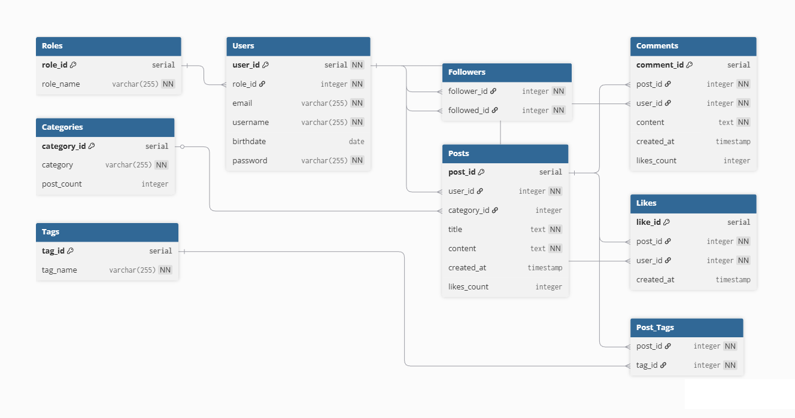

# Postgresql blog database

Simple sql script to create and populate blog database.



## Getting started

### Pre-requirements: Install and familiarize yourself with [Postgresql](https://www.postgresql.org/docs/current/tutorial-start.html).

#### 1. Download blogdb.sql from this repo
 
#### 2. Connect to your local psql server

**Via Terminal:**

````bash
psql -U postgres
````
or use your sql shell.

**Via pgAdmin 4 GUI:**

1. Open pgAdmin 4
2. Right-click on "Servers" in the left panel → "Register" → "Server"
3. Enter a server name (e.g., "LocalServer")
4. Go to the "Connection" tab and enter:
   - Host name: `localhost`
   - Port: `5432` (default)
   - Username: `postgres`
   - Password: (your PostgreSQL password)
5. Click "Save"

#### 3. Create new database blogdb and connect to it

**Via Terminal:**

````bash
# If you already have database named blogdb, use: drop database blogdb; before this command.
create database blogdb;
# Connect to your database
\c blogdb
````

**Via pgAdmin 4 GUI:**

1. Right-click on "Databases" → "Create" → "Database"
2. Enter name: `blogdb`
3. Click "Save"
4. Double-click the `blogdb` database to connect to it
5. Go to "Tools" → "Query Tool"

#### 4. Run script

**Via Terminal:**

Copy the file path:
- Windows: Right-click `blogdb.sql` → Properties → copy the path from "Location" field, or use the address bar
- Mac/Linux: Right-click `blogdb.sql` → Get Info, or use `pwd` in terminal

Run the script into your database:

````bash
\i '/your/full/path/to/blogdb.sql'
````

**Via pgAdmin 4 GUI:**

1. In the Query Tool window, open the file menu or use `Ctrl + O` (or `Cmd + O` on Mac)
2. Select `blogdb.sql` from your file system
3. The script content will load in the editor
4. Click the "Execute" button or press `F5`

## Practice Queries

Now that you've successfully installed the database, practice your SQL skills with these queries sorted from basic to advanced:
1. Retrieve all data from the Users table
2. Display all categories in the database
3. Show all posts with their titles and creation dates
4. Find all users with a specific role (e.g., admin with role = 1)
5. Count the total number of posts in the database
6. Display all posts with more than 100 likes
7. Show username and email of users who have posted content
8. Find the average number of likes per post in each category
9. Display all posts with their category names and author usernames
10. List users with the number of posts they've created (only users with posts)
11. Find the most followed user and retrieve their data
12. Display the most popular posts from each category (highest likes per category)
13. Find users who have both posted and commented on other users' posts
14. Get the top 5 users by total engagement (combined likes on their posts and comments)
15. Find posts with comments from users who also follow the post author

## Contributions

Contributions are welcomed. If you have any modifications/suggestions for this repo, please open a pull request and let me review it.

## Disclaimer

All example data contained in this repository has been synthetically generated using artificial intelligence. Any resemblance to real individuals or actual events is purely coincidental.

